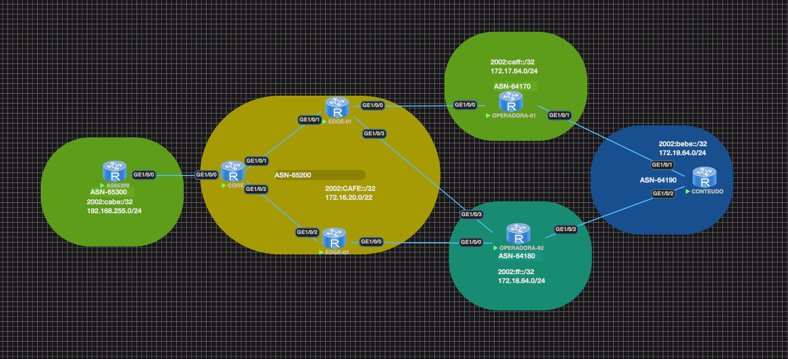

# Huawei Enterprise Router Lab - Políticas de Roteamento SP

Este repositório contém a configuração e a documentação de um laboratório utilizando roteadores Huawei Enterprise, com foco na implementação e validação de políticas de roteamento diferenciadas para um cliente com ASN **65300**. São simulados dois cenários: um onde é anunciada apenas a rota default (0.0.0.0/0) e outro com o anúncio parcial, combinando a rota default e o bloco de endereços do ASN **65200**.

# Nota

Esse laboratorio tem como finalidade apenas testar alguns conceitos importantes dentro de um cenário real. Existem outras formas de se obter o mesmo resultado, que considero até melhores a depender do cenário.

## Sumário

- [Introdução](#introdução)
- [Objetivos](#objetivos)
- [Arquitetura e Topologia](#arquitetura-e-topologia)
- [Detalhamento das Configurações](#detalhamento-das-configurações)
  - [Gerenciamento de VLANs](#gerenciamento-de-vlans)
  - [Roteamento Interno (OSPF/OSPFv3)](#roteamento-interno-ospfospfv3)
  - [Configuração de Interfaces](#configuração-de-interfaces)
  - [Configuração BGP e Políticas de Roteamento](#configuração-bgp-e-políticas-de-roteamento)
  - [Rotas Estáticas](#rotas-estáticas)
- [Testes e Validação](#testes-e-validação)
  - [Capturas de Tela](#capturas-de-tela)
- [Como Utilizar](#como-utilizar)
- [Contribuições](#contribuições)
- [Licença](#licença)

---

## Introdução

Neste laboratório, simulamos um ambiente de rede real utilizando roteadores Huawei Enterprise. O foco é demonstrar a aplicação de políticas de roteamento avançadas para estudantes e etusiatas da area, de forma didatica. (ASN **65300**). A utilização do comando "default-route-advertise" combinado com uso de uma regex nos possibilita que seja feito anuncios que se adequem a determinadas demandas do cotidiano. Cabe destacar que, a implementação em questão não visa ensinar qual a melhor prática para esses cenários. Tendo em vista que há outras formas de se atingir esse mesmo objetivo.

A implementação contempla dois cenários de anúncio de rotas:

- **Rota Default Simples:** entrega exclusiva da rota 0.0.0.0/0.  
- **Rota Parcial:** anúncio condicional, combinando o comando "default-route-advertise", Route-Policy combinado com uma as-path-filter  regexp para filtrar todas as rotas aprendidas pelo ASN **65200**.

---

## Objetivos

- **Segmentação de Políticas de Roteamento:**  
  - Permitir cenários distintos de anúncio de rotas, garantindo o controle refinado do tráfego entre operadoras e clientes.  
  - Validar a eficácia dos filtros de as-path e das route-policies na exportação seletiva de rotas.
  - Demonstrar a utilização do comando "default-route-advertise", Route-Policy combinado com uma as-path-filter  regexp.

---

## Arquitetura e Topologia

- **VLANs e Segmentação:**  
  - **VLAN 300:** Designada para identificar o PTP do cliente (ASN 65300).  
  - **VLANs 4001 e 4002:** Utilizadas para interconexão e separação dos fluxos de tráfego internos.

- **Protocolos de Roteamento:**  
  - **OSPF/OSPFv3:** Configurados com o router ID **10.255.255.1**, possibilitando a importação de rotas diretas e estáticas.  
  - **BGP:** Estabelece peering entre ASN **65200** e **65300**, aplicando políticas específicas para o controle de anúncios de rotas.
  - **iBGP:** Peer iBGP estabelecido usando a loopback0 de cada componente da arquetetura do ASN65200.

- **Interfaces e Conectividade:**  
  - Interfaces VLAN (como Vlanif300, Vlanif4001, Vlanif4002) configuradas com endereços IPv4 e IPv6.  
---

## Detalhamento das Configurações

### Configurando Route-Policys

- **DEFAUL-ROUTE:**  
  As VLANs são configuradas para segmentar o tráfego, possibilitando a separação lógica entre o ambiente do cliente e a operadora.

```plaintext
#
  route-policy DEFAULT-ROUTE-V4-OUT deny node 1            
  route-policy DEFAULT-ROUTE-V6-OUT deny node 1
#
bgp 65200
 peer 2001:DB8:BEBE:CAFE:BEBE::5 as-number 65300
 peer 2001:DB8:BEBE:CAFE:BEBE::5 description CLI-ASN65300
 #
 ipv4-family unicast
  peer 192.168.20.2 enable
  peer 192.168.20.2 route-policy DEFAULT-ROUTE-V4-OUT export
  peer 192.168.20.2 default-route-advertise 
 #
 ipv6-family unicast
  peer 2001:DB8:BEBE:CAFE:BEBE::5 enable
  peer 2001:DB8:BEBE:CAFE:BEBE::5 route-policy DEFAULT-ROUTE-V6-OUT export
  peer 2001:DB8:BEBE:CAFE:BEBE::5 default-route-advertise 
#
  ```
- **PARCIAL-ROUTE:**  

```plaintext
#
  route-policy PARCIAL-ROUTE-V4-OUT permit node 1
    if-match as-path-filter PARCIAL-ROUTE
  route-policy PARCIAL-ROUTE-V4-OUT deny node 2
  route-policy PARCIAL-ROUTE-V6-OUT permit node 1
    if-match as-path-filter PARCIAL-ROUTE
  route-policy PARCIAL-ROUTE-V6-OUT deny node 2
#
ip as-path-filter PARCIAL-ROUTE index 10 permit ^$
#
bgp 65200
 peer 2001:DB8:BEBE:CAFE:BEBE::5 as-number 65300
 peer 2001:DB8:BEBE:CAFE:BEBE::5 description CLI-ASN65300
 #
 ipv4-family unicast
  peer 192.168.20.2 enable
  peer 192.168.20.2 route-policy PARCIAL-ROUTE-V4-OUT export
  peer 192.168.20.2 default-route-advertise 
 #
 ipv6-family unicast
  peer 2001:DB8:BEBE:CAFE:BEBE::5 enable
  peer 2001:DB8:BEBE:CAFE:BEBE::5 route-policy PARCIAL-ROUTE-V6-OUT export
  peer 2001:DB8:BEBE:CAFE:BEBE::5 default-route-advertise 
#
  ```
### Configuração BGP e Políticas de Roteamento

- **Estabelecimento de Peering BGP:**  
  - Peering entre os ASNs 65200 e 65300, com sessões configuradas via IPv4 e IPv6.

- **Route-Policies e as-path-filters:**  
  - **DEFAULT-ROUTE:** Política que nega o anúncio padrão em determinados nós.
  - **PARCIAL-ROUTE:** Permite a exportação condicional da rota default combinada com o bloco do ASN 65200, mediante verificação via as-path-filter.

## Testes e Validação


## Arquitetura e Topologia

A topologia da rede no laboratório é representada na imagem abaixo:


---

## Testes e Validação

Durante os testes, foram registradas capturas de tela para validar o funcionamento da configuração:


### **Anúncio de Rota Default**


### **Anúncio de Rota Parcial**


### **Conectividade com Provedor de Conteúdo**


- **Simulação de Cenários:**  
  São realizados testes para validar ambos os cenários:
  - **Rota Default Simples:** Onde somente a rota 0.0.0.0/0 é anunciada.
  - **Rota Parcial:** Onde a rota default é anunciada juntamente com o bloco do ASN 65200, mediante condições definidas nos filtros e políticas.

- **Ferramentas de Diagnóstico:**  
  Monitoramento do tráfego, verificação de adjacências OSPF/OSPFv3 e sessões BGP, além da análise de logs e tabelas de roteamento para assegurar que as políticas estejam atuando conforme o esperado.

## Como Utilizar

1. **Clone o Repositório:**
   ```bash
   git clone https://github.com/seu-usuario/huawei-router-lab.git
   cd huawei-router-lab
   ```

2. **Estude a Configuração:**  
   - Revise os arquivos de configuração contidos neste repositório.
   - Compare os exemplos com sua infraestrutura para identificar pontos de personalização.

3. **Implementação e Testes:**
   - Utilize um simulador ou ambiente de laboratório (real ou virtual) para aplicar as configurações.
   - Execute testes de conectividade e análise de logs para validar o comportamento das políticas de roteamento.

4. **Adaptação e Customização:**  
   - Ajuste os parâmetros e políticas conforme necessário para seu ambiente de produção ou estudos avançados.
   - Utilize este laboratório como base para aprofundar seus conhecimentos em redes e roteamento.

## Contribuições

Contribuições, sugestões e melhorias são muito bem-vindas! Para contribuir:
- Faça um fork deste repositório.
- Crie uma branch para suas alterações ou novas features.
- Envie um pull request com uma descrição detalhada das mudanças propostas.

## Licença

Este projeto está licenciado sob a [LGP-3.0](LICENSE).

---

Este laboratório foi desenvolvido para demonstrar a aplicação de políticas avançadas de roteamento em ambientes complexos e servir como ferramenta didática para profissionais e entusiastas de redes. Sinta-se à vontade para adaptar e expandir este projeto conforme suas necessidades.
```